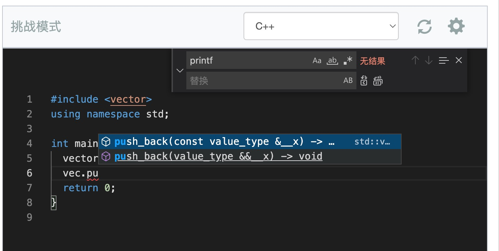

# 中文说明

## 使用方法

- 从 release 下载并解压
- 解压，打开 edge/chrome 的插件管理，打开开发者模式，选择“加载解压缩的扩展”
- 弹出的选项页面，选择 Locale 为 zh_CN，可以启用中文右键菜单
- 如果你没有配置 Language Server，则不要启用对应选项
- 选项页面里面，把编辑器设置里 theme 改成 vs-dark 可以启用暗黑模式

编辑器的使用和 VSCode 差不多，参考 https://code.visualstudio.com/shortcuts/keyboard-shortcuts-windows.pdf

- Ctrl + F 搜索/替换，可以用正则表达式
- Alt + Shift + F 自动格式化

更多的操作和快捷键，可以按 F1 调出菜单面板来查看。如果连上了 Server，右键菜单会有更多选项。

## 代码提示和自动补全

如果要用自动补全，你至少需要一个 Language Server：https://github.com/moeakwak/monaco-language-server

你可以在本地运行（暂未测试 Windows 系统），但是推荐使用 docker。

在本地运行的话，不安装证书 Acwing 可使用。安装证书后 Luogu 也可以使用。

在 Acwing 中的效果如下：

